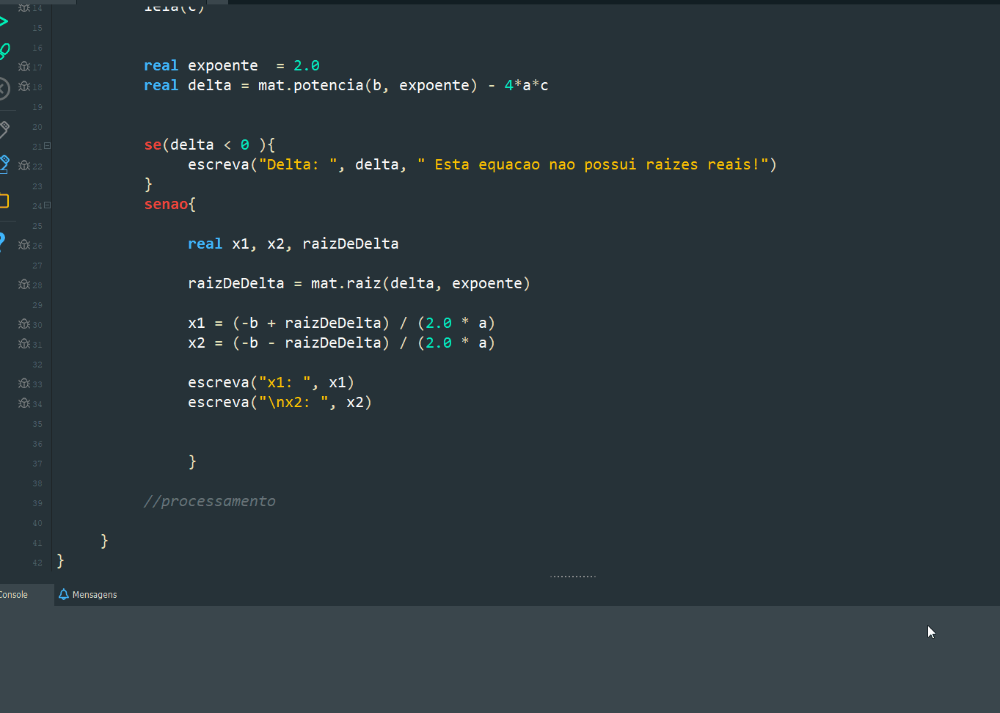

# Projeto - Exercícios de Lógica de programação com portugol 🧠🤯😬

Série de exercícios resolvidos e apresentados. Foram um pouco mais de 50 questões envolvendo estruturas sequenciais , condicionais, repetitivas, vetores e matrizes.

## Tecnologias

- Portugol
- Portugol Studio 👌

